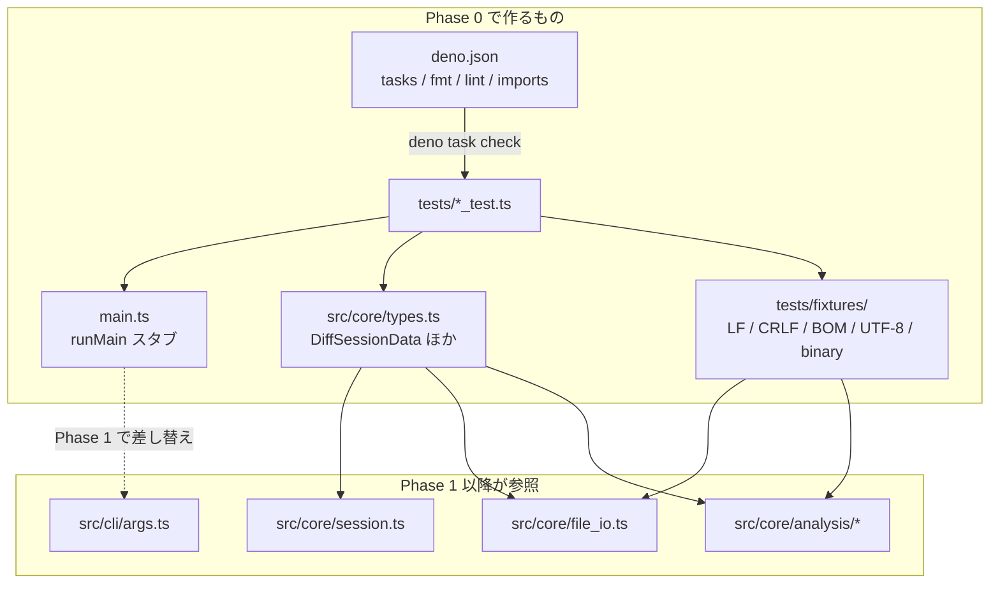

# Requirements

### Overview & Goals

`docs/TODO.md` の **Phase 0: 足場整備** (P0-01 〜 P0-06) を実装する。

Deno テンプレート（`Deno.serve` 雛形）を撤去し、Phase 1
以降で使う開発コマンド・依存・共通型・検証用 fixture を用意する。機能実装（CLI
パース、diff、UI）は行わない。

### Scope

#### In Scope

| ID        | 内容                                                                                                                                   |
| :-------- | :------------------------------------------------------------------------------------------------------------------------------------- |
| **P0-01** | `main.ts` の `Deno.serve` 雛形と `main_test.ts` を撤去し、CLI エントリの最小スタブへ置き換える                                         |
| **P0-02** | `deno.json` に `dev` / `test` / `check` / `compile` タスクと `fmt.exclude`（`docs/`）を定義                                            |
| **P0-03** | `imports` に `@std/cli` / `@std/path` / `@std/fs` / `@std/assert` を追加（`@codemirror/*` は Phase 2 へ保留）                          |
| **P0-04** | `src/core/types.ts` に仕様書5章の `DiffSessionData` / `FileTarget` / `HunkAnnotation` を定義                                           |
| **P0-05** | `tests/fixtures/` に検証用サンプル（ロジック変更 / 空白のみ / コメントのみ / 12行削除 / LF・CRLF / 末尾改行なし / 日本語 UTF-8）を用意 |
| **P0-06** | Deno v2.9+ と Deno Desktop 有効化フラグを `README.md` に記録し、`docs/TODO.md` の Phase 0 チェックボックスと Q-01 を更新               |

付随作業（AC を満たすために必須）:

- ローカル Deno を **v2.8.1 → v2.9.5** へアップグレード（`--unstable-desktop` は
  2.8.1 に存在しない）
- `main_test.ts` 撤去後も `deno test` が exit 0 になるよう、Phase 0
  相当のテストを追加
- fixture が git / エディタで改行正規化されないよう `.gitattributes` を追加
- `dist/` を `.gitignore` に追加

#### Out of Scope

- CLI 引数パース実装（`src/cli/args.ts`）— Phase 1 / P1-01
- ファイル I/O、diff、noise/risk 解析の実装 — Phase 1 / Phase 4
- Deno Desktop ウィンドウ生成・IPC — Phase 1 / P1-09, P1-10
- CodeMirror 6 の導入とバンドル方式決定（Q-03）— Phase 2 / P2-01
- `src/cli` / `src/desktop` / `src/ui` ディレクトリの中身（Phase 0
  では作らない）

### User Stories

- 開発者として、`deno task check` 一発で fmt / lint / 型チェック /
  テストを回したい。以降のフェーズで壊れたことに即座に気づけるようにするため。
- 開発者として、Phase 1 以降の全モジュールが参照する `DiffSessionData`
  型が既に確定していてほしい。実装ごとに型がぶれるのを防ぐため。
- 開発者として、改行コード・末尾改行・マルチバイトを含む fixture
  が最初から揃っていてほしい。Phase 1 の file_io と Phase 4
  の解析テストをすぐ書けるようにするため。

### Functional Requirements

1. `deno task check` が green（`deno fmt --check` / `deno lint` / `deno check` /
   `deno test -A` が全て exit 0）。
2. `deno check` が `main.ts` と `src/core/types.ts` の両方を通る。
3. `src/core/types.ts` は仕様書 `docs/AI-FriendlyDiffToolSpecification.md`
   5章（L87-125）の定義と1対1で一致する。
4. `deno run -A main.ts` では HTTP サーバを起動せず、CLI
   スタブとして即終了する（`Deno.serve` は `deno desktop` の desktop
   ランタイム時のみ起動する）。
5. `docs/` は `deno fmt` の対象外（日本語 Markdown の強制折り返し防止）。
6. `tests/fixtures/` は `deno fmt` / `deno lint`
   の対象外（意図的な空白差分・崩れた整形を保持するため）。
7. `README.md` に Deno v2.9+ 要件、`--unstable-desktop`
   の扱い、開発コマンド一覧が記載されている。

### Non-Functional Requirements

- 既存ドキュメント（`docs/` 配下3ファイル）の内容は Phase 0
  の記録追記以外では変更しない。
- fixture はバイト列として意図した状態（CRLF / 末尾改行なし / BOM）を保持する。
- 追加する依存は JSR の `@std/*` のみ。npm 依存は Phase 2 まで持ち込まない。

# Technical Design

### Current Implementation

| ファイル              | 現状                                                                                                                             |
| :-------------------- | :------------------------------------------------------------------------------------------------------------------------------- |
| `main.ts` (19行)      | `handler(req: Request): Response` を export し、`import.meta.main` で `Deno.serve(handler)`。Deno の新規プロジェクト雛形そのもの |
| `main_test.ts` (17行) | 上記 `handler` に対する `/` と `/api` のテスト2件                                                                                |
| `deno.json` (9行)     | `tasks.dev = "deno run --watch --allow-net main.ts"`、`imports` は `@std/assert` のみ。`fmt` / `lint` セクションなし             |
| `docs/`               | `AI-FriendlyDiffToolSpecification.md`（型定義は L83-125）、`Diffrexv1.0+RoadmapAndDesignGuidelines.md`、`TODO.md`                 |
| その他                | `src/`・`tests/`・`README.md`・`.gitignore`・`.gitattributes` は**未作成**                                                       |

### 調査で判明した2つのブロッカー

**1. ローカル Deno 2.8.1 に `--unstable-desktop` が存在しない**

```
> deno --version
deno 2.8.1 (stable, release, x86_64-pc-windows-msvc)

> deno run --help=unstable
  --unstable-bare-node-builtins / --unstable-bundle / --unstable-cron / --unstable-detect-cjs
  --unstable-kv / --unstable-net / --unstable-raw-imports / --unstable-webgpu ...
  ※ desktop / webview は一覧に無い
```

`deno upgrade --dry-run` で **v2.9.5 が stable
として取得可能**であることを確認済み。

**訂正（プラン承認後に判明・ユーザ指摘）**: Deno 2.9 の Desktop は
`--unstable-desktop` フラグではなく **`deno desktop`
サブコマンド**で提供される（公式ドキュメント:
<https://docs.deno.com/runtime/reference/cli/desktop/>、<https://docs.deno.com/runtime/desktop/>）。ローカル
2.9.5 での実測結果:

- `deno desktop --help` は動作する（トップレベル `deno --help`
  には非表示）。フラグ: `--backend {webview,cef,raw}` / `--hmr` / `-o,--output`
  / `--icon` / `--target` / `--all-targets` / `--engine {v8,quickjs}` /
  `deno run` 相当の権限フラグ。
- アプリモデルは「**`Deno.serve()`
  のハンドラにウィンドウが自動で向く**」方式。ウィンドウ制御は
  `Deno.BrowserWindow`（最初の `new` が起動時ウィンドウを adopt）。
- backend ↔ UI の通信はソケット IPC でなく **in-process
  bindings**（`bindings.<name>()`）。
- 設定は `deno.json` の `desktop` ブロック（`app.name` / `app.identifier` /
  `app.icons` / `backend` / `output` / `release` / `errorReporting`）。
- 素の `deno run` では `Deno.BrowserWindow` は `undefined`（desktop
  ランタイム限定）。これを desktop 判定に使える。

**2. `deno test` はテストファイルが0件だと exit 1**

```
> deno test -A   # 空ディレクトリで実行
error: No test modules found
EXIT=1
```

つまり `main_test.ts` を削除しただけでは `check` タスクが red になり、Phase 0 の
AC を満たせない。→ Phase 0 で実テストを追加する必要がある。

### Key Decisions

# | 決定 | 理由 |

:-- | :-- | :-- | **D1** | ローカル Deno を **v2.9.5**
へアップグレードし、Desktop は `--unstable-desktop`（**存在しない**）ではなく
**`deno desktop` サブコマンド**で扱う |
公式ドキュメントとローカル実測の結果。TODO の P0-02 のフラグ前提は誤りなので
Q-01 に訂正を記録する | **D2** | `@codemirror/*` の `imports` 追加は **Phase 2
へ保留** | ユーザ選択。Q-03（`npm:` 直参照 vs
事前バンドル）が未決定のため、決めてから入れる | **D3** | `main.ts` は
**最小スタブ**（`runMain(args: string[]): number` を export
し、引数をエコーして未実装である旨と exit code を返す） | ユーザ選択。Phase 1 で
`src/cli/args.ts` に差し替える際の接続点が明確になり、かつテスト可能 | **D4** |
`check` タスクの `deno check` 対象を `main.ts src/core/types.ts` にする |
`deno check main.ts` だけでは `types.ts` が誰からも import
されず型チェックされない。AC「`types.ts` が `deno check` を通る」を確実に満たす
| **D5** | `tests/fixtures/` を `fmt.exclude` と `lint.exclude` の両方に入れる |
fixture
は「空白のみ変更」「崩れたインデント」を意図的に含むため、`deno fmt --check` /
`deno lint` が必ず落ちる | **D6** | `.gitattributes` で `tests/fixtures/**`
を改行正規化の対象外にする | CRLF / 末尾改行なしの fixture が git の autocrlf
で壊れると Phase 1 の file_io テストが無意味になる | **D7** | `main.ts` は **CLI
スタブ + 最小 `Deno.serve` UI 雛形**の両対応にする。`"BrowserWindow" in Deno` で
desktop ランタイムを判定し、desktop 時のみ `Deno.serve` を起動する |
ユーザ選択。`deno desktop main.ts` で実際にウィンドウが開くことを Phase 0
で実証し、Q-01 を閉じられる。一方で `deno run` / `deno test` はサーバを掴まない
| **D8** | `deno.json` に `desktop.app.name` / `desktop.app.identifier`
の最小限を入れる（アイコン・`output`・署名は Phase 5） |
ユーザ選択。ウィンドウタイトルとバイナリのメタデータが最初から正しくなる |

### Proposed Changes

#### 1. `main.ts`（全面書き換え・CLI スタブ + desktop UI 雛形）

```ts
/** desktop ランタイム（`deno desktop`）で動作中か。 */
export function isDesktopRuntime(): boolean {
  return "BrowserWindow" in Deno;
}

/** Phase 0 の暫定 UI。Phase 1（P1-11）で `src/ui/index.html` に差し替える。 */
export function handler(_req: Request): Response {/* 引数を表示する HTML */}

/** CLI エントリ（Phase 0: スタブ）。 */
export function runMain(args: string[]): number {
  // 未実装である旨と引数を stderr に出して 2 を返す
}

if (import.meta.main) {
  if (isDesktopRuntime()) {
    Deno.serve(handler); // ウィンドウはこのハンドラに自動で向く
  } else {
    Deno.exit(runMain(Deno.args));
  }
}
```

`main_test.ts` は削除し、`tests/main_test.ts` として `runMain`
の最小テストに置き換える。

#### 2. `deno.json`

```jsonc
{
  "tasks": {
    "dev": "deno run -A main.ts",
    "dev:desktop": "deno desktop --hmr main.ts",
    "test": "deno test -A",
    "check": "deno fmt --check && deno lint && deno check main.ts src/core/types.ts && deno test -A",
    "compile": "deno desktop -o dist/Diffrex main.ts"
  },
  "desktop": { "app": { "name": "Diffrex", "identifier": "io.gitlab.Diffrex" } },
  "fmt": { "exclude": ["docs/", "tests/fixtures/", "dist/"] },
  "lint": { "exclude": ["tests/fixtures/", "dist/"] },
  "imports": {
    "@std/assert": "jsr:@std/assert@1",
    "@std/cli": "jsr:@std/cli@1",
    "@std/fs": "jsr:@std/fs@1",
    "@std/path": "jsr:@std/path@1"
  }
}
```

`&&` は `deno task` の内蔵シェル（deno_task_shell）が解釈するため Windows
でも動作する。

#### 3. `src/core/types.ts`（仕様書5章 L87-125 をそのまま TypeScript 化）

```ts
export interface DiffSessionData {
  sessionId: string;
  timestamp: string;
  mode: "2way" | "3way";
  aiContext?: {
    prompt?: string;
    agent?: string;
    model?: string;
  };
  files: {
    left: FileTarget; // Base (Original)
    right: FileTarget; // Target (AI Generated / Default Save Target)
    base?: FileTarget; // Optional 3-way parent
  };
  outputPath?: string; // Explicit save destination override
  hunks: HunkAnnotation[];
  options: {
    ignoreSpace: boolean;
    ignoreComments: boolean;
  };
}

export interface FileTarget {
  path: string;
  content: string;
  readOnly: boolean;
}

export interface HunkAnnotation {
  id: string;
  lineStartLeft: number;
  lineEndLeft: number;
  lineStartRight: number;
  lineEndRight: number;
  isNoise: boolean;
  riskLevel: RiskLevel;
  status: HunkStatus;
  summaryTag?: string;
}

export type DiffMode = "2way" | "3way";
export type RiskLevel = "normal" | "warning" | "danger";
export type HunkStatus = "unreviewed" | "accepted" | "rejected" | "edited";
```

※ `RiskLevel` / `HunkStatus` / `DiffMode` は Phase 4 の
`analysis/risk.ts`・`analysis/noise.ts` から参照するため named type
として切り出す（フィールドの型自体は仕様書と同一）。

#### 4. `tests/fixtures/`

| ファイル                              | 目的                                                                                                                                                                      |
| :------------------------------------ | :------------------------------------------------------------------------------------------------------------------------------------------------------------------------ |
| `sample_base.ts` / `sample_target.ts` | 主 fixture（LF）。①ロジック変更 ②インデントのみ変更 ③コメントのみ変更 ④連続12行削除 ⑤関数シグネチャ変更 を1組に含める。④⑤は Phase 4 の risk 判定、②③は noise 判定の検証用 |
| `crlf_base.txt` / `crlf_target.txt`   | CRLF 改行の保持検証（P1-06 / P3-04）                                                                                                                                      |
| `no_trailing_newline.txt`             | 末尾改行なしの保持検証                                                                                                                                                    |
| `utf8_ja.txt`                         | 日本語マルチバイト（UTF-8）の読み書き検証                                                                                                                                 |
| `bom_utf8.txt`                        | BOM 保持検証（P3-04）                                                                                                                                                     |
| `binary_sample.bin`                   | NUL バイトを含むバイナリ拒否検証（P1-07）                                                                                                                                 |

#### 5. ドキュメント

- `README.md` 新規作成: 必要な Deno バージョン（v2.9+）、`--unstable-desktop`
  の位置づけ、`dev`/`test`/`check`/`compile` の説明、現在の実装状況（Phase 0
  完了）。
- `docs/TODO.md`: P0-01 〜 P0-06 を `[x]`
  に更新。「現状（着手前のベースライン）」に Phase 0
  完了後の状態を追記。**Q-01** に調査結果（2.8.1 には `--unstable-desktop`
  が無い / 2.9.5 で検証する）を追記。

### File Structure

```
Diffrex/
├── .gitattributes            # [追加] tests/fixtures/** の改行正規化を無効化
├── .gitignore                # [追加] dist/
├── README.md                 # [追加] P0-06
├── deno.json                 # [変更] tasks / fmt / lint / imports
├── main.ts                   # [変更] Deno.serve 雛形 → CLI 最小スタブ
├── main_test.ts              # [削除] → tests/main_test.ts へ
├── docs/
│   └── TODO.md               # [変更] Phase 0 チェック + Q-01 追記
├── src/
│   └── core/
│       └── types.ts          # [追加] P0-04
└── tests/
    ├── main_test.ts          # [追加] runMain スタブのテスト
    ├── types_test.ts         # [追加] 型のコンパイル時検証 + 値の健全性
    ├── fixtures_test.ts      # [追加] fixture のバイト特性が壊れていないことの検証
    └── fixtures/             # [追加] P0-05
        ├── sample_base.ts
        ├── sample_target.ts
        ├── crlf_base.txt
        ├── crlf_target.txt
        ├── no_trailing_newline.txt
        ├── utf8_ja.txt
        ├── bom_utf8.txt
        └── binary_sample.bin
```

### Architecture Diagram



### Risks

| リスク                                                                       | 対策                                                                                                                                                                                                                                    |
| :--------------------------------------------------------------------------- | :-------------------------------------------------------------------------------------------------------------------------------------------------------------------------------------------------------------------------------------- |
| Deno 2.9.5 でも `--unstable-desktop` が存在しない可能性                      | アップグレード直後に `deno run --help=unstable` で実在を確認する。無ければ `dev` からフラグを外し、`dev:desktop` を別タスク化した上で **Q-01** に結果を記録して報告する（Phase 0 の AC 自体は `check` タスクなので green を維持できる） |
| Deno 2.9 で `deno fmt` の整形ルールが変わり既存ファイルが `--check` で落ちる | アップグレード後に `deno fmt` を1回実行してから `--check` を回す                                                                                                                                                                        |
| git の `core.autocrlf` で CRLF / 末尾改行なし fixture が正規化される         | `.gitattributes` に `tests/fixtures/** -text` を指定。`tests/fixtures_test.ts` でバイト特性を検証し、壊れたら CI で検出                                                                                                                 |
| fixture の `.ts` ファイルが `deno lint` / `deno fmt --check` で落ちる        | `fmt.exclude` / `lint.exclude` に `tests/fixtures/` を追加（D5）                                                                                                                                                                        |
| `src/core/types.ts` が未参照で型チェックされない                             | `check` の `deno check` 引数に明示追加（D4）＋ `tests/types_test.ts` から import                                                                                                                                                        |
| Phase 0 の fixture 内容が Phase 4 の noise/risk 期待値とずれる               | fixture 内に「どの行が何のケースか」をコメントで明記し、`fixtures_test.ts` で行数・削除ブロック長（12行）をアサートしておく                                                                                                             |

# Testing

### Validation Approach

Phase 0 は機能実装ではなく足場整備なので、検証の主軸は **`deno task check` が
green になること** と
**後続フェーズが依存する成果物（型・fixture）が壊れていないこと** の2点。

実行コマンド:

```powershell
deno --version          # 2.9.x であること
deno task check         # fmt --check / lint / check / test が全て通ること
deno task test
deno run -A main.ts a b # スタブメッセージが出て exit code 2
```

### Key Scenarios

1. **`deno task check` が exit 0** — fmt / lint / 型チェック /
   テストの4段が通る。
2. **`deno check main.ts src/core/types.ts` が通る** — Phase 1 以降が
   `DiffSessionData` を安全に import できる。
3. **`main.ts` に HTTP サーバが残っていない** — `deno run -A main.ts`
   を実行してもポートを掴まず、スタブメッセージを出して即終了する。
4. **`docs/` が fmt 対象外** — `docs/TODO.md` の日本語行が `deno fmt --check`
   で折り返しを要求されない。
5. **fixture が揃っている** — `tests/fixtures_test.ts` が全 fixture
   の存在と特性を確認する。

### Edge Cases

- `deno test` の対象が0件だと exit 1 になる → Phase 0
  で最低1つの実テストを追加して回避（調査で確認済み）。
- `crlf_*.txt` が LF に正規化されていないこと（内容に `\r\n` が含まれる）。
- `no_trailing_newline.txt` の末尾が `\n` で終わっていないこと。
- `bom_utf8.txt` が `EF BB BF` で始まること。
- `binary_sample.bin` に `0x00` が含まれること。
- `utf8_ja.txt` が UTF-8 として復号でき、期待する日本語文字列を含むこと。
- `sample_base.ts` / `sample_target.ts`
  の削除ブロックがちょうど連続12行であること（Phase 4 の
  `danger`「連続10行超の削除」判定の境界）。

### Test Changes

| ファイル                 | 内容                                                                                                                                                        |
| :----------------------- | :---------------------------------------------------------------------------------------------------------------------------------------------------------- |
| `main_test.ts`           | **削除**（`Deno.serve` 雛形のテストで、対象コードごと撤去されるため）                                                                                       |
| `tests/main_test.ts`     | **追加**: `runMain([])` / `runMain(["a","b"])` が非0の exit code を返し、スタブであることを示す                                                             |
| `tests/types_test.ts`    | **追加**: `DiffSessionData` の完全な値を組み立ててフィールドを assert。型が仕様書どおりであることをコンパイル時に保証（`deno test` は既定で型チェックする） |
| `tests/fixtures_test.ts` | **追加**: 上記 Edge Cases を `Deno.readFile` のバイト列レベルで検証                                                                                         |

削除するのは撤去対象コード（`Deno.serve` 雛形）に対応するテストのみで、skip /
無効化による隠蔽は行わない。

# Delivery Steps

### ✓ Step 1: Deno v2.9 へのアップグレードと Desktop フラグの確認

ローカル Deno が v2.9.5 になり、`--unstable-desktop`
の実在有無が確定・記録されている。

- `deno upgrade` を実行して v2.8.1 → v2.9.5 へ更新し、`deno --version`
  で確認する。
- `deno run --help=unstable` を実行し、`--unstable-desktop`
  が実在するかを確認する。
- **実測結果**: 2.9.5 でも `--unstable-desktop` は存在しない。代わりに
  **`deno desktop` サブコマンド**（`--backend` / `--hmr` / `-o` / `--target`）と
  `Deno.BrowserWindow`、`deno.json` の `desktop` ブロックが正式な方式。
- `dev` は `deno run -A main.ts`、`dev:desktop` は
  `deno desktop --hmr main.ts`、`compile` は
  `deno desktop -o dist/Diffrex main.ts` として定義する（D1 / D7）。
- いずれの結果でも `docs/TODO.md` の **Q-01** に調査結果（2.8.1 には無い / 2.9.5
  での実測結果）を追記する。

### ✓ Step 2: P0-01: Deno.serve 雛形の撤去と CLI 最小スタブ化

`main.ts` が HTTP サーバではなく Diffrex CLI
エントリの最小スタブになり、対応するテストが `tests/` 配下に移っている。

- `main.ts` の `handler` / `Deno.serve` を全て削除する。
- `runMain(args: string[]): number` を export
  し、未実装である旨と受け取った引数を stderr
  に出力して非0の終了コードを返す実装にする。
- `import.meta.main` ガードで `Deno.exit(runMain(Deno.args))` を呼ぶ。
- ルートの `main_test.ts` を削除する。
- `tests/main_test.ts` を追加し、`runMain([])` と `runMain(["a", "b"])`
  が非0コードを返すことを検証する。

### ✓ Step 3: P0-02 / P0-03: deno.json のタスク・除外設定・依存整備

`deno task check` が fmt / lint / 型チェック / テストを一括実行でき、`@std/*`
依存が解決される。

- `main.ts` を D7 の形（CLI スタブ + `isDesktopRuntime()` 判定付きの最小
  `Deno.serve` UI）に更新し、`tests/main_test.ts` に `handler`
  のテストを追加する。
- `tasks.dev` = `deno run -A main.ts`（CLI 経路）、`tasks.dev:desktop` =
  `deno desktop --hmr main.ts`（desktop 経路）。
- `tasks.test` = `deno test -A` を追加する。
- `tasks.check` =
  `deno fmt --check && deno lint && deno check main.ts src/core/types.ts && deno test -A`
  を追加する（`types.ts`
  を明示対象にして未参照でも型チェックされるようにする）。
- `tasks.compile` = `deno desktop -o dist/Diffrex main.ts` を追加する。
- `desktop.app.name` = `Diffrex`、`desktop.app.identifier` を設定する（D8）。
- `deno desktop` で実際にビルド / ウィンドウ起動ができるかを 1
  度検証する（結果は Q-01 に記録）。
- `fmt.exclude` に `docs/`・`tests/fixtures/`・`dist/`、`lint.exclude` に
  `tests/fixtures/`・`dist/` を設定する。
- `imports` に `@std/cli`・`@std/path`・`@std/fs` を JSR
  指定で追加する（`@std/assert` は既存を維持、`@codemirror/*` は Q-03 決定後の
  Phase 2 に回す）。
- `.gitignore` を追加して `dist/` を除外する。

### ✓ Step 4: P0-04: src/core/types.ts の共通型定義

仕様書5章の `DiffSessionData` / `FileTarget` / `HunkAnnotation`
が定義され、型チェックとテストで検証されている。

- `src/core/types.ts` を作成し、`docs/AI-FriendlyDiffToolSpecification.md`
  L87-125 の3つの interface をそのまま定義する。
- `DiffMode`（`"2way" | "3way"`）、`RiskLevel`（`"normal" | "warning" | "danger"`）、`HunkStatus`（`"unreviewed" | "accepted" | "rejected" | "edited"`）を
  named type として切り出し、Phase 4 の解析モジュールから参照できるようにする。
- 各フィールドに仕様書のコメント（left = Base、right = Target / Default Save
  Target、`summaryTag` の例など）を移植する。
- `tests/types_test.ts` を追加し、`DiffSessionData`
  の完全な値を組み立ててフィールドをアサートする（`deno test`
  の既定の型チェックでコンパイル時検証も兼ねる）。

### ✓ Step 5: P0-05: tests/fixtures の検証用サンプル整備

Phase 1 の file_io と Phase 4 の noise/risk 解析が使える fixture
一式が揃い、バイト特性がテストで守られている。

- `tests/fixtures/sample_base.ts` / `sample_target.ts` を作成し、①ロジック変更
  ②インデントのみ変更 ③コメントのみ変更 ④連続12行の削除 ⑤関数シグネチャ変更
  を1組に含める。各ケースの意図をコメントで明記する。
- `crlf_base.txt` / `crlf_target.txt`（CRLF
  改行）、`no_trailing_newline.txt`（末尾改行なし）、`utf8_ja.txt`（日本語
  UTF-8）、`bom_utf8.txt`（BOM 付き）、`binary_sample.bin`（NUL
  バイト入り）を作成する。
- `.gitattributes` を追加し、`tests/fixtures/**` を git
  の改行正規化対象から外す。
- `tests/fixtures_test.ts` を追加し、`Deno.readFile` のバイト列レベルで CRLF
  の存在・末尾改行なし・BOM（`EF BB BF`）・NUL
  バイト・日本語文字列・削除ブロックがちょうど12行であることを検証する。

### ✓ Step 6: P0-06: README とドキュメント更新、AC の最終確認

Deno バージョン要件と開発コマンドが README に記録され、`deno task check` が
green で Phase 0 が完了している。

- `README.md` を新規作成し、必要な Deno バージョン（v2.9+）、`deno desktop`
  の位置づけ（`--unstable-desktop` は存在しない）、`dev` / `dev:desktop` /
  `test` / `check` / `compile` の各タスクの説明、現在の実装状況（Phase 0
  完了・Phase 1 未着手）を記載する。
- `docs/TODO.md` の P0-01 〜 P0-06 を `[x]` に更新し、P0-02 / P0-03
  のフラグ前提を実際の定義に揃える。
- `docs/TODO.md` の **P1-09 / P1-10** を Deno 2.9 の実 API（`deno desktop` /
  `Deno.BrowserWindow` / `Deno.serve` 経由の UI 提供 / in-process
  bindings）に合わせて書き換える。
- `docs/TODO.md` の「現状（着手前のベースライン）」に Phase 0
  完了後の状態を追記する。
- `deno fmt` を1回実行して 2.9 の整形ルールに揃えたうえで、`deno task check`
  を実行し全段が green であることを確認する。
- `deno run -A main.ts a b` を実行し、HTTP
  サーバが起動せずスタブメッセージと非0終了コードが返ることを確認する。
