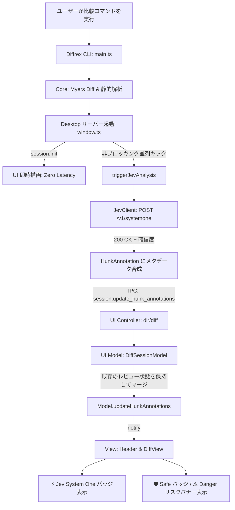

# TypeSafe Jev セマンティック解析 & Confidence-Gated ハイブリッド・レビュー アーキテクチャ

## 1. TypeSafe AI Jev とは何か？ (What is TypeSafe AI Jev?)

### 1.1 汎用 LLM（生成型 AI）との根本的な違い
従来の LLM（GPT-4, Claude, Gemini 等）は、入力されたトークン列の「次に来るもっともらしいトークン」を自己回帰的に予測する**生成的（Generative / Text Completion）**モデルです。

これに対し、**TypeSafe AI Jev** は、Daniel Kahneman の二重過程理論における**「System 1（速い思考：直感・瞬時のパターン認識・トリアージ）」**に特化した、**判定的・構造化推論エンジン（Discriminative & Structured Decision Engine）**です。

| 比較項目 | 汎用 LLM (System Two) | TypeSafe AI Jev (System One) |
| :--- | :--- | :--- |
| **主目的** | 自由記述文の生成、推論の思考プロセス展開、長文執筆 | 高速な分類・評定・確率推定・トリアージ |
| **出力形式** | 自然言語テキスト（マークダウン、JSON 文字列） | **厳密に型付けされた構造化データ（Choice, Score, Noul）** |
| **レイテンシ** | 数秒〜数十秒（ストリーミング生成を伴う） | **数十ミリ秒〜数百ミリ秒**（超高速） |
| **確信度の出力** | テキストで「自信があります」と語る（幻覚・ハルシネーションしやすい） | **数学的な確信度（Confidence Score 0.0〜1.0）と事後確率分布を直接出力** |
| **スキーマ破壊** | JSON モードでも構文エラーや型不一致のリスクが残る | **API レベルで型完全保証**（パースエラーが原理的に発生しない） |
| **トークン消費** | 生成トークン数に比例してコストと時間が肥大化 | 生成トークン数が極小（数十トークン）で極めて安価 |

### 1.2 差分レビューにおける必然性
AI 支援開発において、開発者が求めるのは「1 つの Hunk（差分ブロック）ごとに 5 秒待って長文の感想文を読むこと」ではありません。
開発者が本当に求めているのは：
1. **「この差分は安全か？ 危険か？」**
2. **「プロンプトの指示と合致しているか？ 勝手な余計な変更をしていないか？」**
3. **「その判定に AI はどれくらい自信を持っているか？」**

という **瞬時のトリアージ（即時判断）** です。Jev はこの要件に 100% 合致する唯一無二のアーキテクチャを提供します。

---

## 2. Jev の 3 大推論プリミティブ (Core Primitives)

Jev はすべての推論を以下の 3 つの型安全な質問プリミティブ（Questions）の組み合わせとして定義します。

### 1. ChoiceQuestion（多肢選択 & 分類）
- **用途**: カテゴリ分類、リスク判定、アーキテクチャ層の特定など。
- **入力**: 候補ラベルと、それぞれの判定基準（`criteria`）。
- **出力**:
  - `choice`: 選択されたラベル（文字列）。
  - `confidence`: 選択に対する確信度（0.0〜1.0）。
  - `probabilities`: 各選択肢の事後確率分布（合計 1.0 に正規化されたマップ）。

### 2. ScoreQuestion（段階評価 & ルーブリック評定）
- **用途**: 品質スコア、プロンプト指示合致度、重症度レベルなど。
- **入力**: 離散スコア基準の配列（0 から始まる判定基準リスト `criteria`）。
- **出力**:
  - `score`: 評定スコア（連続値または離散値の数値）。
  - `confidence`: 評定に対する確信度（0.0〜1.0）。
  - `legend`: 各スコアの意味定義（返却された凡例）。
  - `probabilities`: 各スコアに該当する確率分布。

### 3. NoulQuestion（連続確率 & 尤度判定）
- **用途**: 「〇〇である確率」「真偽判定の尤度」「ノイズ度合」など。
- **入力**: 判定したい事象の説明（`instructions`）。
- **出力**:
  - `noul`: 0.0 から 1.0 までの連続値（Probability / Likelihood）。

---

## 3. プロンプティング設計（設問・State・Criteria の作り方）

Jev においては、一般的な「プロンプトエンジニアリング（呪文の詠唱）」とは異なり、**「State（文脈情報）の構造化」** と **「Criteria（判定基準）の排他性・客観性の設計」** が重要となります。

### 3.1 State（文脈テキスト）の構築設計
State はモデルが判断を行うための「前提条件・状況・観察対象」をすべて含める領域です。
Diffrex では、以下のセクション構成でマークダウン構造化しています：

```text
[User Prompt / Instructions]
UserService を非同期化し、ロギングとキャッシュを追加して

[Original Code (Base / Left: lines 1-10)]
export interface User {
  id: string;
  name: string;
}

[Modified Code (Target / Right: lines 1-15)]
export interface User {
  id: string;
  name: string;
  email: string;
  role: "admin" | "member" | "guest";
  createdAt: Date;
}
```

#### 設計ノウハウ:
- **セクション見出しを明示する**: `[User Prompt]`, `[Original Code]`, `[Modified Code]` のようにブラケットで囲むことで、モデルが「指示」と「変更前コード」と「変更後コード」を明確に弁別します。
- **行番号を含める**: 行範囲（lines 1-10）を提示することで、小規模な変更なのか広範な変更なのかをモデルが正確に認識します。
- **余計なノイズを入れない**: ファイル全体の長大なソースではなく、対象 Hunk とその周辺数行（コンテキスト行）に絞って State に渡すことで、トークン数を削減し判断の解像度を最大化します。

### 3.2 Criteria（判定基準）の設計ノウハウ
Jev に渡す基準（`criteria`）は、**境界線が曖昧でないこと**、および **各選択肢が相互に排他的（MECE）であること** が極めて重要です。

#### ❌ 悪い例（曖昧で主観的）:
```json
{
  "danger": "とても危険なコード",
  "warning": "ちょっと気になるコード",
  "normal": "普通のコード"
}
```
*問題点*: 何をもって「とても危険」なのかが不明で、モデルの確信度が分散してしまいます。

#### ⭕ 良い例（Diffrex での実装: 具体的かつ客観的）:
```json
{
  "danger": "Critical logic destruction, security vulnerability, broken API contract, or large unwanted deletion",
  "warning": "Removed error handling, unprompted refactoring, potential regression or edge-case bug",
  "normal": "Expected and safe implementation, bug fix, or clean logic update"
}
```
*利点*: 「エラーハンドリングの削除」「API契約の破壊」など、具体的な事象が列挙されているため、モデルが確信を持って判定できます。

---

## 4. 完全なリクエスト & レスポンス仕様（Wire Format & Real Examples）

### 4.1 エンドポイント仕様
- **URL**: `POST https://api.typesafe.ai/v1/systemone`
- **Headers**:
  - `Authorization: Bearer <TYPESAFE_API_KEY>`
  - `Content-Type: application/json`

### 4.2 リクエスト JSON スキーマと実例

```json
{
  "model": "jev-latest",
  "state": "[User Prompt / Instructions]\nUserService を非同期化し、ロギングとキャッシュを追加して\n\n[Original Code (Base / Left: lines 1-10)]\nexport interface User {\n  id: string;\n  name: string;\n}\n\n[Modified Code (Target / Right: lines 1-15)]\nexport interface User {\n  id: string;\n  name: string;\n  email: string;\n  role: \"admin\" | \"member\" | \"guest\";\n  createdAt: Date;\n}\n",
  "questions": {
    "risk_level": {
      "type": "choice",
      "instructions": "Evaluate the risk level of this code change to the codebase and logic",
      "criteria": {
        "danger": "Critical logic destruction, security vulnerability, broken API contract, or large unwanted deletion",
        "warning": "Removed error handling, unprompted refactoring, potential regression or edge-case bug",
        "normal": "Expected and safe implementation, bug fix, or clean logic update"
      }
    },
    "intent_alignment": {
      "type": "score",
      "instructions": "How well this code change aligns with the user prompt instructions",
      "criteria": [
        "Completely unrelated to the prompt, or AI hallucination",
        "Partially related, but contains unprompted extra modifications",
        "Accurately aligns with the prompt instructions"
      ]
    },
    "is_cosmetic_noise": {
      "type": "noul",
      "instructions": "Is this change purely cosmetic with zero functional/behavioral impact (whitespace, comments, formatting)?"
    }
  }
}
```

### 4.3 レスポンス JSON スキーマと実測生データ

Diffrex の実行時に実際に Jev API から返却されたレスポンスの完全な JSON です：

```json
{
  "model": "jev-1.13.0",
  "answers": {
    "risk_level": {
      "type": "choice",
      "choice": "warning",
      "confidence": 0.39,
      "probabilities": {
        "normal": 0.31,
        "danger": 0.1,
        "warning": 0.59
      }
    },
    "intent_alignment": {
      "type": "score",
      "score": 0.45,
      "confidence": 0.33,
      "legend": {
        "0": "Completely unrelated to the prompt, or AI hallucination",
        "1": "Partially related, but contains unprompted extra modifications",
        "2": "Accurately aligns with the prompt instructions"
      },
      "probabilities": {
        "0": 0.56,
        "1": 0.44,
        "2": 0
      }
    },
    "is_cosmetic_noise": {
      "type": "noul",
      "noul": 0.02
    }
  },
  "usage": {
    "input_tokens": 756,
    "output_tokens": 74
  }
}
```

#### レスポンスの読み解きとセマンティック解析結果:
1. **`risk_level`**:
   - `choice: "warning"`, `probabilities: { warning: 0.59, normal: 0.31, danger: 0.10 }`
   - プロンプト指示（非同期化・ログ・キャッシュ）にない `email` や `role` などのフィールド追加が含まれるため、潜在的リスク（warning）と判定されています。
2. **`intent_alignment`**:
   - `score: 0.45`（0点寄りの部分的一致）、`probabilities: { 0: 0.56, 1: 0.44, 2: 0 }`
   - 「指示と無関係または余計な変更」の確率が極めて高く、Diffrex はこれを検知して `[AI] Intent mismatch / Unprompted edit` の警告タグを自動付与します。
3. **`is_cosmetic_noise`**:
   - `noul: 0.02`（2% のみノイズ）
   - 単なるコメントや改行の変更ではなく、明らかなインターフェース拡張（コード変更）であると正確に見抜いています。
4. **`usage`**:
   - `input_tokens: 756`, `output_tokens: 74`
   - 生成トークンがわずか 74 トークンで済んでおり、数ミリ秒〜数十ミリ秒でレスポンスが完了します。

---

## 5. Diffrex 実装アーキテクチャ (Diffrex Architecture)

Diffrex では、この高速な Jev API を Deno Desktop / Smalltalk-80 MVC に統合しています。



### 1. 非同期並列パイプライン (`src/desktop/window.ts`)
```typescript
const triggerJevAnalysis = (session: DiffSessionData, ws: WebSocket) => {
  const jev = new JevClient();
  if (!jev.isConfigured() || !session.hunks || session.hunks.length === 0) return;

  (async () => {
    try {
      const updated = await analyzeHunksWithJev({
        hunks: session.hunks,
        leftContent: session.files.left.content,
        rightContent: session.files.right.content,
        prompt: session.aiContext?.prompt,
        jevClient: jev,
      });
      session.hunks = updated;
      sendToSocket(ws, {
        type: "session:update_hunk_annotations",
        hunks: updated,
      });
    } catch (err) {
      console.warn("[Jev Desktop] Background analysis error:", err);
    }
  })();
};
```

### 2. 進捗を壊さないマージロジック (`src/ui/model/diff_session_model.ts`)
ユーザーがレビューを行っている最中に非同期解析結果が届いても、ユーザーの入力（`status: accepted / rejected / edited`）は絶対に上書きしません：
```typescript
updateHunkAnnotations(newHunks: HunkAnnotation[]): void {
  if (!this._session) return;
  const hunkMap = new Map<string, HunkAnnotation>(newHunks.map(h => [h.id, h]));
  const currentHunks = this._session.hunks ?? [];
  
  this._session.hunks = currentHunks.map((oldHunk) => {
    const updated = hunkMap.get(oldHunk.id);
    if (!updated) return oldHunk;
    return {
      ...updated,
      status: oldHunk.status, // ユーザーのレビュー状態を維持
    };
  });
  this.notify(this);
}
```

---

## 6. Confidence-Gated レビュー基盤 (B-20)

確信度スコアをトリガーとしたハイブリッドレビューのワークフローです。

```
[Hunk のトリアージ判定]
  │
  ├── normal かつ Confidence >= 85% ─────► 【🛡️ Safe】
  │                                        ヘッダーに Safe バッジ表示
  │                                        レビュー負荷最小（即パス可能）
  │
  ├── danger または Confidence < 50%
  │   または Intent === 0 ──────────────► 【⚠️ Needs Review】
  │                                        リスクバナー赤/橙強調
  │                                        「🔍 Explain」ボタン提示
  │                                             │ (クリック)
  │                                             ▼
  │                                        【System Two 深掘り解説】
  │                                        背景・潜在リスク・推奨アクション展開
  │
  └── その他の変更 ─────────────────────► 通常レビュー（キーボード A / R / E）
```

---

## 7. 他システムへの展開レシピ（Extending Jev Beyond Diffrex）

Jev の構造化推論エンジンとしての特性は、Diffrex の差分比較以外にも幅広いソフトウェアエンジニアリング領域へ水平展開が可能です。

### レシピ 1: CI/CD 自動マージ判定ゲート（Auto-Merge Guardrail）
PR が出された際、CI パイプライン内で GitHub Actions から Jev を呼び出し、リスクと確信度を評価します。

```typescript
// ci_automerge_check.ts
const response = await jev.systemOne({
  state: `[PR Title]\n${pr.title}\n[PR Diff]\n${pr.diff}`,
  questions: {
    can_automerge: {
      type: "choice",
      instructions: "Is this PR completely safe to auto-merge without human approval?",
      criteria: {
        approve: "Trivial doc/comment updates, dependency lock bump with pass tests, cosmetic typo fixes",
        require_human: "Any functional change, config change, database migration, or security touch"
      }
    }
  }
});

const ans = response.answers["can_automerge"] as ChoiceAnswer;
if (ans.choice === "approve" && ans.confidence >= 0.90) {
  await approveAndMergePR(pr.number);
} else {
  await requestHumanReviewers(pr.number);
}
```

### レシピ 2: コミット前セキュリティ・機密情報スキャン（Pre-commit Hook）
Git の `pre-commit` フックで、コミットされようとしているステージング内容に秘密鍵、API トークン、生パスワード、危険なパーミッションが含まれていないかをミリ秒単位で検査します。

```typescript
// pre_commit_guard.ts
const stagedDiff = await getGitStagedDiff();
const result = await jev.systemOne({
  state: stagedDiff,
  questions: {
    has_leak: {
      type: "noul",
      instructions: "Probability that this diff contains leaked secrets, credentials, or private keys"
    }
  }
});

const leakProb = (result.answers["has_leak"] as NoulAnswer).noul;
if (leakProb > 0.7) {
  console.error("❌ Commit blocked: High probability of leaked secrets detected by Jev!");
  Deno.exit(1);
}
```

### レシピ 3: AI コーディングエージェントの自己検証ループ（Self-Reflection Loop）
AI エージェント（Cursor, Windsurf, Devin 等）が自らコードを書き換えた直後に、自らの変更がユーザーの要求を満たしているかを客観的に「自己採点」させるガードレールとして機能します。

```typescript
// agent_self_reflection.ts
const evalResult = await jev.systemOne({
  state: `[Goal]\n${userGoal}\n[Generated Code]\n${generatedCode}`,
  questions: {
    goal_completion: {
      type: "score",
      instructions: "Evaluate goal achievement completeness",
      criteria: [
        "Incomplete / Missing critical logic",
        "Partially implemented with TODOs",
        "Fully implemented and production-ready"
      ]
    },
    code_smell: {
      type: "noul",
      instructions: "Likelihood of anti-patterns, infinite loops, or resource leaks"
    }
  }
});
```

---

## 8. まとめと今後の展望

TypeSafe AI Jev (System One) の導入により、Diffrex は**「単に文字の違いを見せるツール」**から、**「AI の生成意図と潜在リスクを構造的に解釈するインテリジェント・レビューワークベンチ」**へと進化しました。

- **超高速（低レイテンシ）**
- **型完全保証（Zero Schema Failure）**
- **確信度に基づくトリアージ（Confidence-Gated）**

この設計思想は、今後の大規模コード生成時代における開発者体験（DX）の標準基盤となるモデルケースです。
