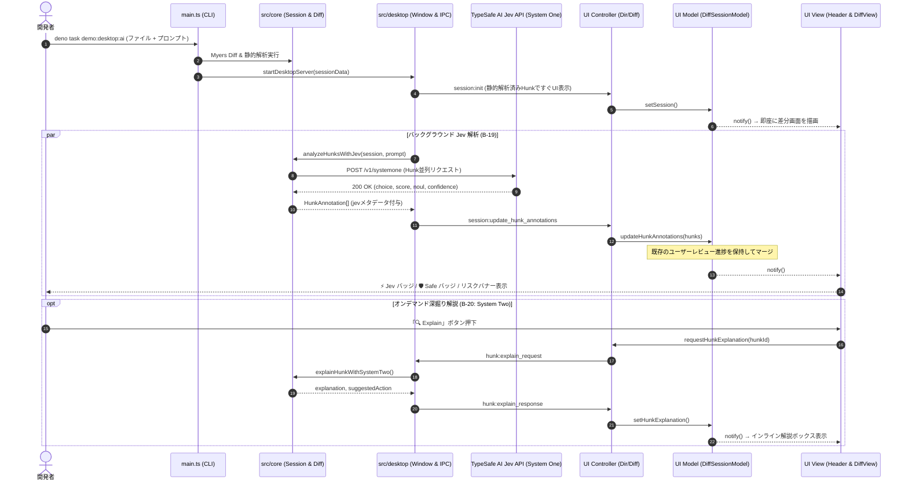

# TypeSafe Jev セマンティック解析 & Confidence-Gated ハイブリッド・レビュー アーキテクチャ

## 1. 概要と背景 (Overview & Motivation)

AI 支援コーディング（Cursor, Claude Code, GitHub Copilot 等）の普及に伴い、開発者がレビューすべき差分の性質は大きく変化しました。従来の差分ツールにおける静的ヒューリスティクス（正規表現、行数変化、AST 構文木解析）だけでは、以下の問題に直面します：

1. **プロンプト指示との乖離（Intent Mismatch / Hallucination）**:
   開発者が指示したプロンプトと無関係なファイルやクラスが AI によって勝手に書き換えられていても、構文的に正しければ静的解析では検知できない。
2. **潜在的ロジック破壊（Subtle Semantic Regressions）**:
   エラーハンドリングの勝手な削除、バリデーションロジックの緩和、非同期処理の競合など、見た目には綺麗なコードに潜む危険性を評価できない。
3. **過剰なレビュー負荷（Review Fatigue）**:
   AI が生成する大量のコード変更に対して、人間が全行を均等にレビューするのは非現実的であり、安全な変更と精査すべき変更のトリアージが不可欠。

`Diffrex` では、**B-19** および **B-20** の実装により、**TypeSafe AI Jev (System One)** を中核に据えたセマンティック解析エンジンと、確信度（Confidence Score）に基づく **Confidence-Gated ハイブリッド・レビュー基盤** を導入しました。

これにより、高確信度で安全な差分（Safe）の素早いトリアージと、危険・不確実な差分に対するオンデマンド深掘り解説（System Two）を両立する、業界初の AI レビュー体験を提供します。

---

## 2. システム全体アーキテクチャ (End-to-End Architecture)

Diffrex の Jev 統合は、UI の描画パフォーマンスと操作性を損なわない **非ブロッキング・プログレッシブ更新パイプライン** として設計されています。

### データフロー図



### 設計原則
1. **即時性（Zero Latency First）**:
   ファイルを開いた瞬間はまず静的解析結果（Myers Diff + 静的ノイズ・リスク判定）で UI を即座に表示します。Jev API の完了を待って画面が白くなったりブロックされることは一切ありません。
2. **プログレッシブ更新（Progressive Enhancement）**:
   Jev の推論結果が返ってきた時点で IPC 経由で Hunk のアノテーションを更新し、バッジやリスクレベルが滑らかにアップデートされます。
3. **ユーザー進捗の不可侵（Progress Preservation）**:
   Jev の非同期解析が完了した時点で、ユーザーが既にキーボードで「承認（A）」や「編集（E）」を行っていた場合でも、ユーザーのレビュー進捗（`status`）を上書き破壊しないマージロジックを備えています。

---

## 3. TypeSafe Jev System One 設問設計 (Atomic Questions)

TypeSafe AI の System One は、単一の自由記述プロンプトではなく、**厳密に型付けされた Atomic Questions（Choice, Score, Noul）** を通じて超低レイテンシ・高精度な判断を出力します。

`src/core/analysis/semantic_analysis.ts` では、各 Hunk ごとに以下の 3 つの設問を組み立てて問い合わせます。

### 1. State（文脈コンテキストの構築）
Jev に与える文脈情報として、プロンプト指示および差分箇所の前後コードを構造化テキストとして合成します：

```text
[User Prompt / Instructions]
UserService を非同期化し、ロギングとキャッシュを追加して

[Original Code (Base / Left: lines 1-10)]
export interface User {
  id: string;
  name: string;
}

[Modified Code (Target / Right: lines 1-15)]
export interface User {
  id: string;
  name: string;
  email: string;
  role: "admin" | "member" | "guest";
  createdAt: Date;
}
```

### 2. 設問（Questions）の定義
- **`risk_level` (ChoiceQuestion)**:
  - 目的: コード変更がコードベースおよび動作ロジックに与える危険度の分類
  - 選択肢:
    - `danger`: 致命的なロジック破壊、セキュリティ脆弱性、公開API契約の破壊、意図しない大量削除
    - `warning`: エラーハンドリングの勝手な削除、プロンプトにないリファクタリング、潜在的デグレ
    - `normal`: 期待通りの安全な実装、バグ修正、クリーンなロジック更新
  - 返却値: `choice`（選択肢）、`confidence`（確信度 0.0〜1.0）、`probabilities`（各クラスの事後確率）
- **`intent_alignment` (ScoreQuestion)**:
  - 目的: プロンプト指示に沿った変更かどうかの適合度評価
  - スコア基準:
    - `0`: プロンプトと完全に無関係、または AI のハルシネーション
    - `1`: 部分的に合致しているが、未指示の余計な変更が含まれる
    - `2`: プロンプトの指示に正確に合致している
  - 返却値: `score`（0〜2）、`confidence`、`legend`、`probabilities`
- **`is_cosmetic_noise` (NoulQuestion)**:
  - 目的: 動作に一切影響を与えない純粋な装飾的ノイズ（空白、コメント、フォーマット変更）である確率
  - 返却値: `noul`（0.0〜1.0 の連続値）

### 3. レスポンスによる Hunk の再評価
Jev からの回答に基づき、`HunkAnnotation` の以下のフィールドを更新します：
- `riskLevel`: Jev の `risk_level` 判定で上書き。
- `isNoise`: `noul >= 0.8` の場合にノイズ認定。
- `confidence`: `risk_level` の確信度を格納。
- `intentAlignment`: プロンプト合致度スコア（0〜2）を格納。
- `analysisSource`: `"jev"` を設定。
- `summaryTag`: Intent 不一致（`score === 0`）の場合は `"[AI] Intent mismatch / Unprompted edit"` を自動付与し、リスクを最低でも `warning` に引き上げ。

---

## 4. Confidence-Gated ハイブリッド・レビュー基盤 (B-20)

確信度（Confidence）を活用し、開発者の認知負荷を最小化する 2 段階のレビュー構造です。

### 1. System One と System Two の協調

| レイヤー | 使用技術 | 役割 | 実行タイミング | レイテンシ |
| :--- | :--- | :--- | :--- | :--- |
| **System One** (B-19) | TypeSafe AI Jev | 全 Hunk の高速スクリーニング、型安全な分類、確信度算出 | ファイル比較開始時に自動並列実行 | 数十〜数百ms |
| **System Two** (B-20) | LLM / ルールベース深掘りエンジン | 疑わしい変更に対する背景解説、潜在リスクの指摘、推奨アクション提示 | ユーザーが「🔍 Explain」をクリックした時のみ | オンデマンド |

### 2. トリアージ基準（Triage Logic）
`DiffSessionModel` は、各 Hunk のリスクと確信度を以下の基準でトリアージします：

- **Safe (高確信度で安全)**:
  - 条件: `riskLevel === "normal"` かつ `confidence >= 0.85` (既定)
  - 表示: ヘッダーに `🛡️ N safe` バッジを表示。安全性が保証されているため、開発者はレビューを素早く完了可能。
- **Needs Review (要精査)**:
  - 条件: `riskLevel === "danger"` または `confidence < 0.50` (既定) または `intentAlignment === 0`
  - 表示: リスクバナーを赤／オレンジで強調表示し、「🔍 Explain」ボタンを提示。
- **Unprompted Edit (プロンプト未指示の変更)**:
  - 条件: `intentAlignment === 0` かつプロンプトが存在
  - 表示: 紫色／赤色のタグ `[AI] Intent mismatch / Unprompted edit` を付与。

### 3. 確信度しきい値のカスタマイズ (Confidence Settings)
開発チームやプロジェクトの厳格度に応じて、メニューバー「表示 (View)」→「確信度しきい値設定 (Confidence Thresholds...)」から動的に変更できます：
- **Safe 判定しきい値**: 50% 〜 99%（既定: 85%）
- **Needs Review 判定しきい値**: 10% 〜 80%（既定: 50%）
- 設定値はブラウザ／WebView の `localStorage`（キー: `diffrex:confidence_thresholds`）に自動永続化されます。

---

## 5. 原初 GUI MVC (Smalltalk-80) との統合

UI 設計は、プロジェクトの基本方針である「ライブラリ非依存の原初 GUI MVC パターン」に厳格に従っています。

### 1. Model (`src/ui/model/diff_session_model.ts`)
- `updateHunkAnnotations(newHunks: HunkAnnotation[])`:
  受信した Jev 解析結果の配列から ID でマップを引き、ユーザーの操作状態（`status: "accepted" | "rejected" | "edited"`）を保持しながら、`riskLevel`, `confidence`, `probabilities`, `intentAlignment`, `analysisSource` をマージします。
- `hasJevAnalysis`:
  いずれかの Hunk が `analysisSource === "jev"` を持っているかを判定するゲッター。
- `safeCount` / `needsReviewCount`:
  現在の確信度しきい値に基づいて集計するリアクティブなゲッター。

### 2. Controller (`src/ui/controller/dir_controller.ts` & `diff_controller.ts`)
- バックエンドからの WebSocket メッセージ `session:update_hunk_annotations` を受領。
- 単一ファイルモードの `diffModel` だけでなく、マルチタブコンテナ内の全タブ（`tab.diffModel`）に対して漏れなく伝播。
- オンデマンド解説要求（`requestHunkExplanation`）を受け取り、IPC 経由でバックエンドに `hunk:explain_request` を送信。

### 3. View (`src/ui/components/Header.tsx` & `DiffView.tsx`)
- **Header**:
  - `hasJevAnalysis` が真になると、左上にピンク色の `⚡ Jev System One` バッジをレンダリング。
  - `safeCount > 0` の場合、中央の統計欄に緑色の `🛡️ N safe` バッジをレンダリング。
- **DiffView (RiskBannerWidget)**:
  - Hunk の上部に、確信度バー、判定元バッジ（`[Jev]`）、プロンプト合致度を表示。
  - 右端に「🔍 Explain」ボタンを配置し、クリックでローディングアニメーションと共に System Two 解説を展開。

---

## 6. 障害耐性とフォールバック (Fault Tolerance & Security)

外部 API 連携において最も重要な「信頼性と堅牢性」を確保するための安全機構を備えています：

1. **環境変数の安全管理**:
   - `TYPESAFE_API_KEY` はカレントディレクトリの `.env` またはシステムの環境変数から取得します。
   - `src/core/env.ts` により、Deno の起動オプション `--env` を明示しなくても `.env` から自動ロードされます。
   - `.gitignore` に `.env` が登録され、API キーが誤ってリポジトリにコミットされる事故を防止しています（`.env.sample` のみを追跡）。
2. **完全なグレースフル・フォールバック**:
   - `TYPESAFE_API_KEY` が設定されていない場合、またはオフライン環境やタイムアウト（既定 5000ms）が発生した場合でも、エラーで処理が止まることはありません。
   - 自動的に `analysisSource: "static"` の静的解析モードとして動作を継続します。
3. **オブザーバビリティ（詳細ログ出力）**:
   - バックエンド起動時および Jev API 呼出時に、ターミナルへ ANSI カラー付きでリクエスト URL、ペイロード、HTTP ステータス、レスポンス JSON、トークン消費量を出力し、通信状況を完全に可視化します。
   - UI 側（WebView の DevTools コンソール）でも受信イベントをログ出力し、双方向でデバッグが容易です。

---

## 7. 関連ファイル一覧

| ファイルパス | 役割・責務 |
| :--- | :--- |
| `src/core/analysis/jev_client.ts` | TypeSafe AI Jev (System One) API クライアント（HTTP fetch、型定義） |
| `src/core/analysis/semantic_analysis.ts` | Hunk State 構築、Atomic Questions 組み立て、非ブロッキング並列実行 |
| `src/core/analysis/deep_dive.ts` | System Two オンデマンド深掘り解説生成ロジック |
| `src/core/env.ts` | `.env` ファイルの自動読み込みユーティリティ |
| `src/desktop/window.ts` | Desktop サーバーにおける Jev 解析のキックおよび IPC 配信 |
| `src/desktop/ipc.ts` | バックエンド ⇄ UI 間の型付き IPC メッセージ定義 |
| `src/ui/model/diff_session_model.ts` | Hunk アノテーションのプログレッシブ更新、確信度集計、解説保持 |
| `src/ui/controller/diff_controller.ts` | UI 側での IPC 受信処理、解説リクエスト発行 |
| `src/ui/controller/dir_controller.ts` | ディレクトリ／マルチタブ環境における IPC メッセージの全タブ分配 |
| `src/ui/components/Header.tsx` | `⚡ Jev System One` バッジおよび `🛡️ Safe` バッジの描画 |
| `src/ui/components/DiffView.tsx` | リスクバナー、確信度バー、「🔍 Explain」ボタンおよび解説のインライン描画 |
| `src/ui/components/ConfidenceSettingsModal.tsx` | 確信度しきい値設定モーダルダイアログ |
| `tests/jev_client_test.ts` | JevClient 単体テスト（モック API、タイムアウト、エラー処理） |
| `tests/semantic_analysis_test.ts` | セマンティック解析・HunkState 構築・フォールバックテスト |
| `tests/confidence_gated_review_test.ts` | Confidence-Gated、トリアージ、深掘り解説、しきい値設定の統合テスト |
