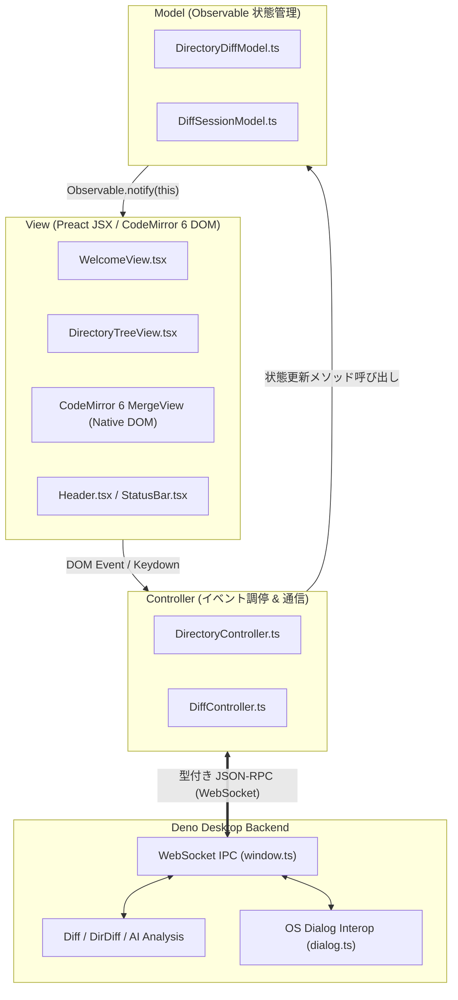
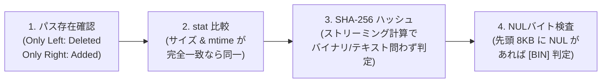
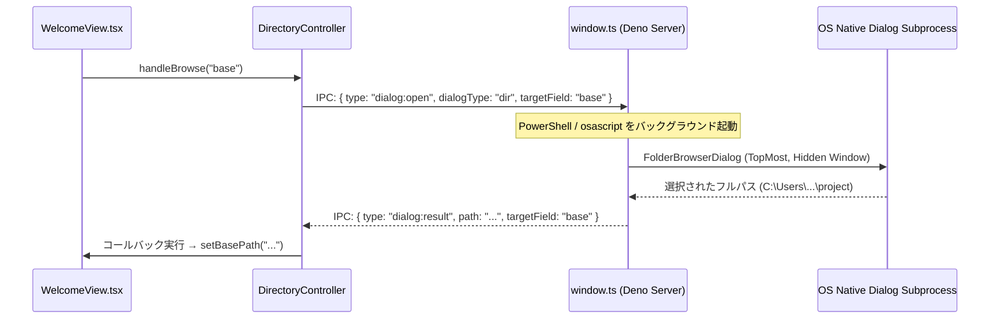

# Diffrex UI アーキテクチャ & 技術仕様ナレッジ

本ドキュメントでは、`Diffrex` における UI 設計、状態管理、CodeMirror 6 統合、ディレクトリ比較エンジン、AI 解析、および OS ネイティブ連携の技術的仕組みと詳細実装を解説します。

---

## 1. 原初 GUI MVC アーキテクチャ (Smalltalk-80 スタイル)

`Diffrex` は React/Redux のような重厚な仮想 DOM 状態管理ライブラリに依存せず、**Smalltalk-80 スタイルの原初 GUI MVC パターン**を採用しています。

### なぜ原初 GUI MVC なのか？
1. **CodeMirror 6 との親和性**: CodeMirror 6 は独自の状態管理（`EditorState`, `StateField`, `Transaction`）とネイティブ DOM レンダリングを持つため、仮想 DOM フレームワークによる全体再描画と衝突しやすい。MVC によりエディタ内部の更新と外側 UI（ツリーやステータス）の更新を直交して扱える。
2. **局所的な再描画**: Model は `Observable<T>` を継承し、変更があった Model を購読している View（`useModel` フック）のみがピンポイントで再描画される。
3. **テスタビリティ**: Model と Controller が UI DOM なしで単体テスト可能（`tests/ui_model_test.ts`, `tests/ui_controller_test.ts`）。

---

## 2. ディレクトリ比較 & 遅延ロードエンジン

### 2.1 段階的差分判定パイプライン (Tiered Diffing)
数千〜数万ファイルが存在するリポジトリでも高速に判定を行うため、4段階のパイプラインで差分を確定します。

1. **除外判定 (`ignore.ts`)**:
   - デフォルト除外（`.git`, `node_modules`, `dist`, `.DS_Store` 等）および各ディレクトリの `.gitignore` を再帰パース。
2. **ステータス集約 (Tree Rollup)**:
   - 各ファイルのステータス（`modified` / `added` / `deleted` / `binary` / `identical`）を親ディレクトリノードにバブルアップ集約。配下に1つでも変更があれば親フォルダも `[M]` と判定。

### 2.2 遅延ロード (On-demand Diff) 通信プロトコル
- **起動時**: バックエンドはファイルの中身を読まず、ツリーのメタ構造（`DirectoryDiffSessionData`）のみを `dir:tree_data` として転送。
- **選択時**: ユーザーがツリーノードをクリックした瞬間に `{ type: "file:diff_request", relativePath }` を送信。
- **Diff 生成**: バックエンドは該当ファイルのみを読み込み、Myers Diff と AI 解析（Noise / Risk）を実行して `file:diff_data` を返却。

---

## 3. CodeMirror 6 MergeView 拡張 & AI レビュー機能

### 3.1 差分エディタ構成
- `@codemirror/merge` の `unifiedMergeView` または 2-Way `MergeView` を利用。
- 左エディタ（`base` / 変更前 / 読み取り専用）と右エディタ（`target` / 変更後 / 編集可能）を並列配置。

### 3.2 ノイズ差分の自動判定 (Noise Filter)
AST パースおよび正規表現により、以下の変更を「ノイズ」として分類します。
- **空白・インデントのみの変更**:
  `line.replace(/\s+/g, "")` によるトークン同一性検査。
- **コメントのみの追加・変更**:
  文字列リテラル（`"..."`, `'...'`, `` `...` ``）内部の `//` や `#` を保護した上で、行コメント・ブロックコメントを除去して比較。
- **折りたたみ UI**:
  `Ctrl+N` またはトグルスイッチにより、ノイズと判定された Hunk を `EditorState` のデコレーション（`Decoration.replace`）で一括折りたたみ。

### 3.3 リスク変更の警告バッジ (Risk Heuristics)
AI 生成コード特有の破壊的変更を検出し、差分ブロックのガターやヘッダに `[Danger]` / `[Warning]` バッジを表示します。

| リスクレベル | 判定ルール | 検出理由 |
| :--- | :--- | :--- |
| **Danger** | 10行超の連続削除 | AI による必要なロジックの誤削除 |
| **Danger** | 関数 / クラス / 型定義のシグネチャ変更 | 外部呼出元を壊す破壊的変更 |
| **Warning** | `try-catch`, `finally` 等のエラーハンドリング削除 | 例外安全性の低下 |
| **Warning** | ハードコードされたシークレット（APIキー、トークン）の追加 | セキュリティリスク |
| **Normal** | 上記に該当しない小規模なコード変更 | 通常の修正 |

### 3.4 ワンキー・レビューアクション
- `A`（承認: Accepted）: Hunk を承認マークし、次へフォーカス移動。
- `R`（拒否: Rejected）: 右側（Target）の内容を左側（Base）で上書き（Undo）して次へ移動。
- `E` / `Enter`（編集: Edit）: 当該 Hunk にカーソルを合わせ、エディタを直接フォーカス。
- `Ctrl+R` / `Ctrl+L`: 左右間のブロック単位マージ。

---

## 4. OS ネイティブダイアログ連携 (Zero-Dependency Interop)

ブラウザ/WebView 標準の `<input type="file">` はセキュリティ上の制約からローカルの絶対パスを取得できません。`Diffrex` では Deno バックエンドを介して OS ネイティブのダイアログを起動します。

### Windows での非表示・最前面起動の工夫
- **シェルウィンドウ非表示**: `powershell.exe` の引数に `-WindowStyle Hidden` を指定し、黒いコンソールウィンドウを出さない。
- **最前面表示**: WinForms の `TopMost = $true` なダミー親フォームを渡すことで、ダイアログが `Diffrex` ウィンドウの背面に隠れるのを防止。

---

## 5. 安全な原子的保存 (Atomic File Write)

編集後のコードを保存する際、クラッシュや電源断によるファイル破損を防ぐため、**原子的書き込み (Atomic Write)** を徹底しています。

1. **同一ディレクトリ内に一時ファイルを作成**:
   `path/to/.target.ts.tmp.<pid>.<timestamp>`
2. **メタデータの復元**:
   元のファイルから検知した「改行コード（LF / CRLF）」「BOM（Byte Order Mark）」「末尾改行の有無」を適用して一時ファイルへ書き出し。
3. **アトミックな置き換え**:
   `Deno.rename(tempPath, targetPath)` を実行。同一ファイルシステム内の inode / ディレクトリエントリ置換となるため、瞬時に完了し元ファイルを破損させません。
